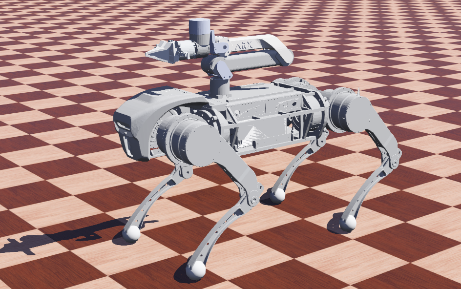

# qm_ho_control

Hierarchical optimization control for quadrupedal manipulator

## Dependence

* webots 2023b
* Eigen
* pinocchio
* qpOASES
* yaml-cpp

## Install

## Install Dependence
* webots 2023b

    Download webots 2023b in official website.Download [webots project](https://github.com/Zionshang/Webots). Open `AliengoZ1/worlds/AliengoZ1_desiredArmJoint.wbt`


* Eigen

```
sudo apt update
sudo apt install libeigen3-dev
```

* pinocchio

[Recommended installation](https://stack-of-tasks.github.io/pinocchio/download.html)

If you're stuck in this step
```
 echo "deb [arch=amd64 signed-by=/etc/apt/keyrings/robotpkg.asc] http://robotpkg.openrobots.org/packages/debian/pub $(lsb_release -cs) robotpkg" \
     | sudo tee /etc/apt/sources.list.d/robotpkg.list
```
Try
```
sudo echo "deb [arch=amd64 signed-by=/etc/apt/keyrings/robotpkg.asc] http://robotpkg.openrobots.org/packages/debian/pub $(lsb_release -cs) robotpkg" \
     | sudo tee /etc/apt/sources.list.d/robotpkg.list
```

* qpOASES

```
git clone https://github.com/coin-or/qpOASES.git
mkdir build
cd build
cmake -DCMAKE_POSITION_INDEPENDENT_CODE=ON ..
make
sudo make install
```

* yaml-cpp
```
git clone https://github.com/jbeder/yaml-cpp.git
cd yaml-cpp
mkdir build && cd build
cmake ..
make
sudo make install
```
